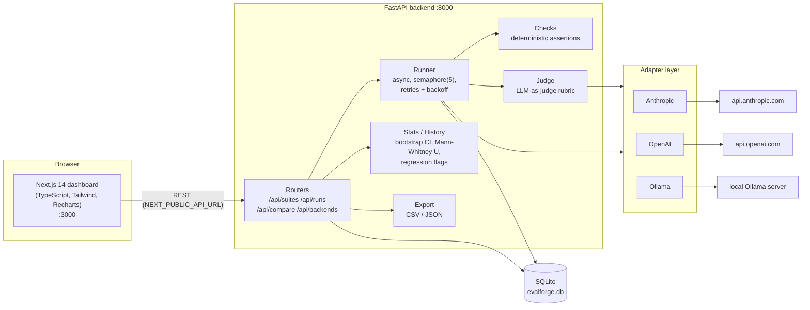

# EvalForge

An LLM evaluation platform for teams iterating on prompts. Define **test suites**
of prompts, run them against multiple LLM backends (Anthropic, OpenAI, Ollama),
score the outputs three ways — **deterministic checks**, **LLM-as-judge**, and
**statistics** — and track quality regressions across prompt versions over time.

## Features

- **Test suites & cases** — prompts with expected behavior, optional gold reference
  answer, tags, and per-case deterministic assertions.
- **Multi-backend runs** — execute a suite against any mix of `anthropic`, `openai`,
  and `ollama` models in one run, labeled with a prompt-template version
  (e.g. `v3`). Optional prompt template wraps every case via a `{prompt}` placeholder.
- **Deterministic checks** — `contains`, `not_contains`, `regex`, `not_regex`,
  `json_valid`, `max_length`; instant, free, zero-variance pass/fail per response.
- **LLM-as-judge** — a configurable judge model (default `anthropic:claude-opus-4-8`)
  scores each response 1–5 on *correctness*, *relevance*, and
  *instruction_following*, with a stored rationale.
- **Statistics** — mean, sample std, 95% bootstrap percentile CI per model per run;
  two-sided Mann-Whitney U test (tie-corrected normal approximation) between runs,
  with plain-English interpretation. Pure numpy, no scipy.
- **Regression tracking** — score-over-time chart per suite per model; a run whose
  95% CI does not overlap its predecessor's *and* whose mean dropped is flagged as
  a regression and surfaced as a red alert on the dashboard.
- **Run diffing** — compare two runs of the same suite side-by-side, per case and
  per model, with judge scores, rationales, and check results for each side.
- **Export** — any run as CSV (one row per case × model) or JSON.
- **Graceful degradation** — providers with no API key show as unavailable and the
  UI disables them; nothing crashes without keys.

Model IDs use the `provider:model` format, split on the first colon:
`anthropic:claude-opus-4-8`, `openai:gpt-4o-mini`, `ollama:llama3.1`.

## Screenshots

> Screenshots are not committed yet — drop PNGs into `docs/screenshots/` with the
> filenames below and they will render here.


## Architecture



- **Backend**: FastAPI + SQLAlchemy 2.0 + Pydantic v2, SQLite (no external DB).
  Runs execute in the background via `BackgroundTasks`; the frontend polls run
  status every 2s while a run is pending/running.
- **Frontend**: Next.js 14 App Router, TypeScript strict, Tailwind, Recharts.
  Reads the API base URL from `NEXT_PUBLIC_API_URL` (default `http://localhost:8000`).

## Quickstart

### Option A — Docker (one command)

```bash
docker-compose up --build
```

Frontend at <http://localhost:3000>, API at <http://localhost:8000>
(interactive docs at `/docs`). The SQLite database lives on a named volume
(`evalforge-data`), so runs survive rebuilds.

API keys are read from `backend/.env` if present (see [Configuration](#configuration));
the stack runs fine without keys — those providers just show as unavailable.
To use a host-local Ollama from inside Docker, the compose file defaults
`OLLAMA_BASE_URL` to `http://host.docker.internal:11434`.

To seed demo data into the containerized DB:

```bash
docker-compose exec backend python -m app.seed
```

> Note: requires Docker Compose v2.24+ (the compose file uses the optional
> `env_file` syntax).

### Option B — Local development

Prerequisites: Python 3.11+ (3.12 recommended) and Node 18+.

**Backend** (terminal 1):

Windows (PowerShell):

```powershell
cd backend
python -m venv .venv
.venv\Scripts\pip install -r requirements.txt
copy .env.example .env       # then add your API keys (optional)
.venv\Scripts\python -m uvicorn app.main:app --reload
```

macOS / Linux:

```bash
cd backend
python3 -m venv .venv
.venv/bin/pip install -r requirements.txt
cp .env.example .env         # then add your API keys (optional)
.venv/bin/python -m uvicorn app.main:app --reload
```

**Frontend** (terminal 2):

```bash
cd frontend
npm install
npm run dev
```

Open <http://localhost:3000>. Tables are created automatically on backend startup.

### Option B (shortcut) — both servers, one command

After the one-time setup above (create the backend `.venv` + install its
requirements, and `npm install` in `frontend/`), run both together from the
repo root:

```bash
npm start
```

This runs [`dev.mjs`](dev.mjs), a zero-dependency Node launcher (no root
`npm install` needed) that starts the FastAPI backend and the Next.js frontend
side by side, streams both logs with a colored `[backend]`/`[frontend]` prefix,
and stops both on Ctrl+C. Backend → <http://localhost:8000>, frontend →
<http://localhost:3000>.

(`npm run dev` is intentionally left to mean *frontend only* — run it inside
`frontend/`. Use `npm start` from the repo root to launch both.)

If 8000 is busy — or Windows has it in a reserved range (uvicorn reports
`WinError 10013 ... forbidden by its access permissions`) — pick another port;
the frontend is pointed at it automatically:

```bash
BACKEND_PORT=8010 npm start        # macOS/Linux, or Git Bash on Windows
$env:BACKEND_PORT=8010; npm start  # PowerShell
```

`FRONTEND_PORT` overrides 3000 the same way.

### Configuration

Copy `backend/.env.example` to `backend/.env` and fill in what you need.
Every variable has a working default; keys are only needed to actually call
that provider.

| Variable | Default | Purpose |
| --- | --- | --- |
| `ANTHROPIC_API_KEY` | *(unset)* | Enables the `anthropic` provider. Unset → provider reported unavailable. |
| `OPENAI_API_KEY` | *(unset)* | Enables the `openai` provider. Unset → provider reported unavailable. |
| `OLLAMA_BASE_URL` | `http://localhost:11434` | Ollama server; availability is probed via `GET /api/tags` (2s timeout). In Docker use `http://host.docker.internal:11434`. |
| `EVALFORGE_DB_PATH` | `./evalforge.db` | SQLite file path. The compose file sets `/data/evalforge.db` on a named volume. |
| `DEFAULT_JUDGE_MODEL` | `anthropic:claude-opus-4-8` | Judge used when a run doesn't specify one. |
| `GENERATION_MAX_TOKENS` | `1024` | Max tokens for candidate generations. |
| `JUDGE_MAX_TOKENS` | `1024` | Max tokens for judge calls. |
| `EVALFORGE_API_TOKEN` | *(unset)* | Shared bearer-token gate. Unset → open API. Set → all `/api` (except `/api/health`) requires `Authorization: Bearer <token>`. |
| `EVALFORGE_RATE_LIMIT_PER_MINUTE` | `120` | Per-client (token, else IP) request cap over a 60s window; `0` disables. Over the cap → `429`. |
| `EVALFORGE_USE_MIGRATIONS` | `false` | `true` → startup runs Alembic `upgrade head` instead of `create_all`. The compose file sets it `true`. |

The frontend has two build-time variables (baked into the client bundle):
`NEXT_PUBLIC_API_URL` (default `http://localhost:8000`) — the URL the *browser*
uses to reach the API — and `NEXT_PUBLIC_API_TOKEN` (default empty) — must match
the backend's `EVALFORGE_API_TOKEN` when the auth gate is enabled.

### Hardening (optional)

All off/relaxed by default so local dev stays zero-config. See [`docs/SPEC.md`](docs/SPEC.md) §13–14.

- **Auth gate** — set `EVALFORGE_API_TOKEN` (and build the frontend with a
  matching `NEXT_PUBLIC_API_TOKEN`) to require a shared bearer token. Export
  download links pass it as `?token=…` since anchors can't set headers.
- **Rate limiting** — `EVALFORGE_RATE_LIMIT_PER_MINUTE` caps per-client
  requests; `/api/health` is exempt. In-memory/per-process (scale-out wants Redis).
- **Pagination** — `GET /api/suites` and `GET /api/runs` accept `?limit=&offset=`
  and return the total in the `X-Total-Count` header; omitting them returns the
  full list (backward compatible).
- **Migrations** — schema is versioned with Alembic under `backend/migrations/`.
  For a DB created via `create_all`, adopt migrations once with `alembic stamp head`,
  then evolve via `alembic revision --autogenerate -m "…"` and `alembic upgrade head`.

### Seed demo data

From `backend/` (with the venv active or using the venv's python):

```bash
python -m app.seed             # 2 demo suites (10 cases each) + 4 synthetic runs per suite
python -m app.seed --no-runs   # suites and cases only, no synthetic runs
python -m app.seed --force     # delete and recreate the demo suites
```

The synthetic runs are back-dated across the last week (versions v1–v4) with a
deliberate regression in v4 for `openai:gpt-4o-mini`, so the dashboard shows a
populated score-over-time chart and a red regression alert out of the box.
Responses are clearly marked `[synthetic demo response]` — no API keys needed.

### Run the tests

```bash
cd backend
.venv/Scripts/python -m pytest    # Windows; use .venv/bin/python elsewhere
```

The suite (~unit + API tests) uses a fresh temp SQLite DB per test and fakes all
LLM calls — no network required.

## API overview

All endpoints are JSON under `/api` (interactive docs at `http://localhost:8000/docs`).

| Method | Path | Description |
| --- | --- | --- |
| GET | `/api/health` | Liveness check → `{"status": "ok"}`. |
| GET | `/api/backends` | Provider availability + suggested models per provider. |
| GET | `/api/suites` | List suites with case/run counts. |
| POST | `/api/suites` | Create suite (409 on duplicate name). |
| GET | `/api/suites/{id}` | Suite detail including its cases. |
| PUT | `/api/suites/{id}` | Update name/description. |
| DELETE | `/api/suites/{id}` | Delete suite (cascades to cases, runs, results). |
| POST | `/api/suites/{id}/cases` | Add a test case (prompt, expected behavior, reference, tags, assertions). |
| PUT | `/api/cases/{case_id}` | Update a case (all fields optional). |
| DELETE | `/api/cases/{case_id}` | Delete a case. |
| POST | `/api/runs` | Create a run (suite, models, prompt_version, optional template/judge); executes in background. |
| GET | `/api/runs?suite_id=` | List runs newest-first with live progress `{total, done}`. |
| GET | `/api/runs/{id}` | Run detail: per-case results + per-model stats (mean, std, 95% CI, dimensions, checks pass rate, latency). |
| GET | `/api/runs/{id}/export.json` | Download full run as JSON. |
| GET | `/api/runs/{id}/export.csv` | Download one row per case × model as CSV. |
| GET | `/api/compare?run_a=&run_b=` | Mann-Whitney U per shared model + per-case side-by-side results (same suite, both completed). |
| GET | `/api/suites/{id}/history?model=` | Score-over-time series per model with `first/stable/regression/improvement` flags. |

## Design decisions

The scoring pipeline is the heart of the tool, so its statistical choices are
documented here in some detail.

### Why bootstrap percentile CIs (1,000 resamples)

A run's per-model score sample is a set of per-case *overall* scores — each the
mean of three integer 1–5 judge dimensions. These samples are **discrete, bounded
to [1, 5], frequently skewed** (good models pile up near the top of the scale),
and small (typically 10–50 cases). Classical normal-theory intervals
(mean ± 1.96·SE) assume an approximately normal sampling distribution and can
produce absurdities like an upper bound above 5. The **bootstrap percentile
method** — resample the scores with replacement, take the mean of each resample,
report the 2.5th and 97.5th percentiles of those means — makes no distributional
assumption, respects the scale's bounds automatically, and is a few lines of
numpy. 1,000 resamples is plenty for stable 2.5/97.5 percentile estimates at
these sample sizes and costs well under a millisecond. API responses use a fixed
seed (42) so the intervals are **deterministic across refreshes** — a dashboard
whose error bars wiggle on reload reads as broken. Known caveat: percentile
bootstrap can under-cover at very small n; for a handful of cases, treat the
band as indicative, not inferential.

### Why Mann-Whitney U instead of a t-test

Judge scores are **ordinal**: nothing guarantees the gap between "3" and "4"
equals the gap between "4" and "5" in quality terms. A t-test assumes
interval-scale data drawn from (approximately) normal distributions — both
assumptions are violated by bounded, discrete, heavily tied 1–5 data at typical
eval sample sizes. The **Mann-Whitney U test** compares the two runs by *ranks*,
asking whether one run's scores tend to be larger, which is exactly the
ordinal-safe question and is robust to skew and outliers. The trade-off is that
it tests stochastic dominance rather than a difference in means, so the compare
view reports the two means alongside U and p to convey direction and magnitude.

### Normal approximation with tie correction

The exact U distribution is combinatorial and awkward with ties, so EvalForge
uses the standard **large-sample normal approximation** — with two corrections
that matter a lot for this data:

- **Tie correction.** With 1–5 integer dimensions, per-case overall scores can
  only take 13 distinct values (multiples of ⅓), so ties are the norm, not the
  exception. The rank variance is deflated accordingly:
  σ² = (n₁n₂/12)·((N+1) − Σ(t³−t)/(N(N−1))), where t are tie-group sizes.
  Skipping this overstates σ and systematically inflates p-values (missed
  differences).
- **Continuity correction.** U is discrete; ±0.5 toward the mean before
  computing z reduces small-sample error.

Edge cases are defined, not accidental: if every pooled value is identical,
σ = 0 and p = 1.0. p is computed via `math.erfc` and clipped to [0, 1] — the
whole thing is numpy + stdlib, keeping scipy out of the dependency tree. This
*is* an approximation: it is trustworthy at roughly n ≥ 8–10 per side; below
that, read p-values as rough guidance.

### The regression-alert rule, and why it is conservative

History flags each completed run against the *previous* run of the same
(suite, model): **regression** iff the two 95% bootstrap CIs do **not** overlap
*and* the mean decreased (mirror-image rule for **improvement**; otherwise
**stable**). Requiring non-overlapping 95% CIs is deliberately **stricter than
p < 0.05** on a two-sample test — two means can differ significantly while
their individual CIs still overlap (the overlap criterion behaves closer to a
p ≈ 0.01 test). That conservativeness is a feature for an alerting surface:
a red alert should mean "stop and look", and a rule that fires on marginal
wobbles trains users to ignore it. The direction condition keeps improvements
from ever reading as alerts. A run+model needs at least 2 scored results to
produce a history point at all.

### Judge-model bias caveats

LLM judges are useful but not neutral instruments. Known failure modes to keep
in mind when reading scores:

- **Self-preference / family bias** — judges tend to rate outputs from their own
  model family higher.
- **Verbosity bias** — longer, more elaborate answers often score higher than
  equally correct terse ones.
- **Format and position effects** — confident tone, markdown polish, and answer
  structure can sway scores independent of substance.
- **No cross-judge calibration** — a 4.2 from one judge model is not comparable
  to a 4.2 from another. Keep `judge_model` **fixed** across any runs you intend
  to compare; the judge is recorded per run so this is auditable.

EvalForge's mitigations: a fixed rubric with explicit 1–5 anchors and three
separate dimensions (rather than one vibes score), the gold reference answer
injected into the rubric when available, the judge's rationale stored on every
result for spot-checking, and deterministic checks as a judge-independent
signal. The default judge is a strong model (`anthropic:claude-opus-4-8`);
using a weak judge to referee strong candidates inverts the measurement.

### Deterministic checks as a cheap first gate

Assertions (`contains`, `regex`, `json_valid`, `max_length`, …) cost nothing,
run instantly, and have **zero variance** — a failed `json_valid` is a fact, not
an opinion. They catch the most common hard failures (broken output format,
missing required keys, blown length budgets, forbidden content) without spending
a single judge token, and their pass rate is a stable metric that cannot drift
when you change judge models. Both signals are recorded side by side — checks do
not gate the judge call, they complement it — and the semantics are tri-state:
`checks_passed` is `null` (not `true`) when a case has no assertions or
generation failed, so "no checks" is never conflated with "passed checks".

### Concurrency and retries

The runner fans a run out into (case × model) tasks under an
`asyncio.Semaphore(5)`, where one task = one generation **plus** its checks and
judge call — so at most 5 LLM calls are in flight at once. Five is a deliberate
politeness setting: fast enough that a 10-case × 2-model run finishes in
seconds, low enough to stay clear of provider rate/concurrency limits without
per-provider tuning. Transient failures (all provider SDK/network errors are
normalized to a single `AdapterError`) are retried up to 3 attempts with
**exponential backoff (1s, 2s, 4s) plus 0–0.5s uniform jitter** so parallel
tasks don't retry in lockstep against an already-struggling endpoint. The retry
count is persisted on every result for observability. Each case result is
persisted as it completes, which powers the live progress bar and means a
partially failed run still yields data: per-case errors are stored on the
result, and the run completes as `completed` (a run is `failed` only on an
unexpected top-level error).

## Project layout

```
backend/                 FastAPI app (Python 3.11+)
  app/
    adapters/            Anthropic / OpenAI / Ollama behind one LLMAdapter ABC
    services/            checks, judge, stats, runner, history, export
    routers/             suites, cases, runs, compare, backends
    seed.py              demo data seeder (python -m app.seed)
  tests/                 pytest suite (no network; fake adapters)
frontend/                Next.js 14 App Router + TS + Tailwind + Recharts
  app/                   /, /suites, /suites/[id], /runs, /runs/[id], /compare
  lib/api.ts             typed fetch client mirroring the API schemas
docs/SPEC.md             the binding technical specification
docker-compose.yml       backend + frontend, one command
```

See [`docs/SPEC.md`](docs/SPEC.md) for the full API contract, database schema,
scoring semantics, and chart spec.
